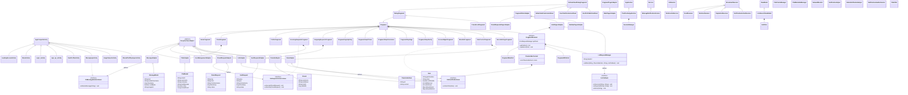

# UML Class Diagram - MainProjApp

## הוראות שימוש
פתח את הקישור בקובץ `mermaid_url.txt` בדפדפן, או העתק את הקוד שלמטה לאתר https://mermaid.live

## קוד Mermaid

```mermaid
classDiagram
    direction TB

    %% Android Base Classes
    class AppCompatActivity
    class Fragment
    class DialogFragment
    class BottomSheetDialogFragment
    class Application
    class Service
    class JobService
    class BroadcastReceiver
    class ViewModel
    class FragmentPagerAdapter
    class FragmentStateAdapter
    class RecyclerViewAdapter["RecyclerView.Adapter"] {
        <<abstract>>
    }

    DialogFragment --|> Fragment
    BottomSheetDialogFragment --|> DialogFragment

    %% Activities
    class LoadingScreenActivity
    class MainActivity
    class Login_activity
    class sign_up_activity
    class UserProfileActivity
    class MessagingActivity
    class ImageViewerActivity
    class SharedPrefDisplayerActivity

    AppCompatActivity <|-- LoadingScreenActivity
    AppCompatActivity <|-- MainActivity
    AppCompatActivity <|-- Login_activity
    AppCompatActivity <|-- sign_up_activity
    AppCompatActivity <|-- UserProfileActivity
    AppCompatActivity <|-- MessagingActivity
    AppCompatActivity <|-- ImageViewerActivity
    AppCompatActivity <|-- SharedPrefDisplayerActivity

    %% Fragments
    class HomeFragment
    class ChatsFragment
    class ProfileFragment
    class FriendsListFragment
    class IncomingRequestsFragment
    class OutgoingRequestsFragment
    class FragmentSignUpEntry
    class FragmentStep1Phone
    class FragmentStep2Username
    class FragmentStep3Age
    class FragmentStep4Verify

    Fragment <|-- HomeFragment
    Fragment <|-- ChatsFragment
    Fragment <|-- ProfileFragment
    DialogFragment <|-- FriendsListFragment
    Fragment <|-- IncomingRequestsFragment
    Fragment <|-- OutgoingRequestsFragment
    Fragment <|-- FragmentSignUpEntry
    Fragment <|-- FragmentStep1Phone
    Fragment <|-- FragmentStep2Username
    Fragment <|-- FragmentStep3Age
    Fragment <|-- FragmentStep4Verify

    %% Sub-nav Fragments
    class AccountMgmtFragment
    class BlacklistFragment
    class GateControlFragment
    class ServerSettingsFragment

    Fragment <|-- AccountMgmtFragment
    Fragment <|-- BlacklistFragment
    Fragment <|-- GateControlFragment
    Fragment <|-- ServerSettingsFragment

    %% Bottom Sheets
    class AdminGatePermissionSheet
    class UserGatePermissionSheet
    class UserProfileBottomSheet

    BottomSheetDialogFragment <|-- AdminGatePermissionSheet
    BottomSheetDialogFragment <|-- UserGatePermissionSheet
    BottomSheetDialogFragment <|-- UserProfileBottomSheet

    %% List Fragments
    class FragmentBaseList {
        <<abstract>>
        #ListRequestManager apiClient
        +getFullList() List
        +updateList(List) void
    }
    class FragmentBlacklist
    class FragmentWhitelist

    Fragment <|-- FragmentBaseList
    FragmentBaseList <|-- FragmentBlacklist
    FragmentBaseList <|-- FragmentWhitelist
    FragmentBaseList *-- ListRequestManager

    %% Interfaces
    class OnMessageDeleteListener {
        <<interface>>
        +onDeleteMessage(String) void
    }
    class OnGateClickListener {
        <<interface>>
        +onGateClick(Gate) void
    }
    class OnRequestActionListener {
        <<interface>>
        +onAccept(FriendRequest) void
        +onDecline(FriendRequest) void
    }
    class ListCallback {
        <<interface>>
        +onSuccess(String, String) void
        +onRejected(String, String) void
        +onError(String) void
    }

    %% RecyclerView Adapters
    class ChatAdapter
    class MessageAdapter
    class FriendRequestAdapter
    class SentRequestAdapter
    class GateAdapter
    class UserManagementAdapter
    class ListAdapter
    class FriendsAdapter

    RecyclerViewAdapter <|-- ChatAdapter
    RecyclerViewAdapter <|-- MessageAdapter
    RecyclerViewAdapter <|-- FriendRequestAdapter
    RecyclerViewAdapter <|-- SentRequestAdapter
    RecyclerViewAdapter <|-- GateAdapter
    RecyclerViewAdapter <|-- UserManagementAdapter
    RecyclerViewAdapter <|-- ListAdapter
    RecyclerViewAdapter <|-- FriendsAdapter

    MessageAdapter --> OnMessageDeleteListener : defines
    GateAdapter --> OnGateClickListener : defines
    FriendRequestAdapter --> OnRequestActionListener : defines
    ListRequestManager --> ListCallback : defines

    %% Pager Adapters
    class MainPagerAdapter
    class FriendRequestsPagerAdapter
    class ListsPagerAdapter
    class SubNavPagerAdapter

    FragmentPagerAdapter <|-- MainPagerAdapter
    FragmentStateAdapter <|-- FriendRequestsPagerAdapter
    FragmentStateAdapter <|-- ListsPagerAdapter
    FragmentStateAdapter <|-- SubNavPagerAdapter

    ListsPagerAdapter *-- FragmentBaseList
    ListsPagerAdapter o-- ListRequestManager

    %% Models
    class Gate {
        -String gateNumber
        -String state
        -boolean isClickable
        -int visibilityLevel
        -int controlLevel
        -Map allowedUsers
        -Map allowedAdmins
    }
    class ChatModel {
        -String chatId
        -String username
        -String nickname
        -String lastMessage
        -boolean online
        -Long unreadCount
    }
    class MessageModel {
        -String text
        -String senderUsername
        -long timestamp
        -boolean sentByMe
        -String imageUrl
    }
    class Friend {
        -String username
        -String safeEmail
        -String chatId
        -long addedAt
    }
    class FriendRequest {
        -String key
        -String from
        -String fromUsername
        -long timestamp
        -String status
    }
    class SentRequest {
        -String key
        -String to
        -String toUsername
        -long timestamp
        -String status
    }
    class PlaceholderContent {
        +List~PlaceholderItem~ items
    }
    class PlaceholderItem {
        +String id
        +String content
    }
    PlaceholderContent *-- PlaceholderItem

    %% Services and Receivers
    class ChatCacheApplication
    class MessageNotificationService
    class DeletionJobService
    class BootReceiver
    class DeletionReceiver
    class ExpirationReceiver
    class NotificationActionReceiver

    Application <|-- ChatCacheApplication
    Service <|-- MessageNotificationService
    JobService <|-- DeletionJobService
    BroadcastReceiver <|-- BootReceiver
    BroadcastReceiver <|-- DeletionReceiver
    BroadcastReceiver <|-- ExpirationReceiver
    BroadcastReceiver <|-- NotificationActionReceiver

    %% Managers and Helpers
    class SessionManager
    class ChatCacheManager
    class ChatMetadataManager
    class NetworkMonitor
    class NotificationHelper
    class AdminNotificationHelper
    class NotificationHandlerService
    class ListRequestManager {
        -String baseUrl
        +addItem(String, PlaceholderItem, String, ListCallback) void
    }
    class ChatUtils
    class ListFilter
    class ListsSearchViewModel

    ViewModel <|-- ListsSearchViewModel
    ListsSearchViewModel *-- ListFilter
    ChatCacheApplication *-- SessionManager

    %% Interface Implementations
    MessagingActivity ..|> OnMessageDeleteListener
    GateControlFragment ..|> OnGateClickListener
    IncomingRequestsFragment ..|> OnRequestActionListener

    %% Composition and Aggregation
    ChatAdapter o-- ChatModel
    MessageAdapter o-- MessageModel
    FriendRequestAdapter o-- FriendRequest
    SentRequestAdapter o-- SentRequest
    GateAdapter o-- Gate
    FriendsAdapter o-- Friend
    ListAdapter o-- PlaceholderItem

    ChatsFragment *-- ChatAdapter
    GateControlFragment *-- GateAdapter
    IncomingRequestsFragment *-- FriendRequestAdapter
    OutgoingRequestsFragment *-- SentRequestAdapter
```
